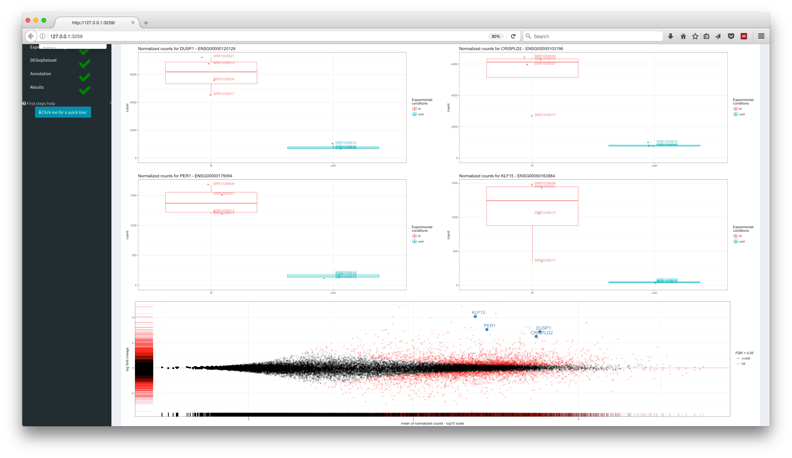

<!-- **Package**: `r Rpackage("ideal")` -->

<!-- **Authors**: `r packageDescription("ideal")[["Author"]]` -->

<!-- **Version**: `r packageDescription("ideal")$Version` -->

**Compiled date**: `r Sys.Date()`

**Last edited**: 2017-04-04

**License**: `r packageDescription("ideal")[["License"]]`


```{r setup, echo=FALSE, warning=FALSE}
set.seed(42)
# knitr::opts_chunk$set(comment=NA,
#                fig.align="center",
#                fig.width = 7,
#                fig.height = 7,
#                warning=FALSE)
```

# Getting started

<p align="center">

</p>

`r Biocpkg("ideal")` is an R package distributed as part of the [Bioconductor](http://bioconductor.org) project. To install the package, start R and enter:

```{r installation, eval=FALSE}
source("http://bioconductor.org/biocLite.R")
biocLite("ideal")
```

The GitHub repository for `r Biocpkg("ideal")` is https://github.com/federicomarini/ideal. This is the place to file an issue, report a bug, or provide a pull request.

Once `r Rpackage("ideal")` is installed, it can be loaded by the following command.

```{r loadlibrary, message=FALSE}
library("ideal")
```


# Introduction

`r Biocpkg("ideal")` is a Bioconductor package containing a Shiny application for analyzing RNA-Seq data in the context of differential expression. This enables an interactive and at the same time analysis, keeping the functionality accessible, and yet providing a comprehensive selection of graphs and tables to mine the dataset at hand.

`r Biocpkg("ideal")` is an R package which fully leverages the infrastructure of the Bioconductor project in order to deliver an interactive yet reproducible analysis for the detection of differentially expressed genes in RNA-Seq datasets. Graphs, tables, and interactive HTML reports can be readily exported and shared across collaborators. The dynamic user interface displays a broad level of content and information, subdivided by thematic tasks. All in all, it aims to enforce a proper analysis, by reaching out both life scientists and experienced bioinformaticians, and also fosters the communication between the two sides, offering robust statistical methods and high standard of accessible documentation.

It is structured in a similar way to the `r Biocpkg("pcaExplorer")`, also designed as an interactive companion tool for RNA-seq analysis focused rather on the exploratory data analysis e.g. using principal components analysis as a main tool.

The interactive/reactive design of the app, with a dynamically generated user interface makes it easy and immediate to apply the gold standard methods (in the current implementation, based on `r Biocpkg("DESeq2")`) in a way that is information-rich and accessible also to the bench biologist, while also providing additional insight also for the experienced data analyst. Reproducibility is supported via state saving and automated report generation.

## Citation info

If you use `r Biocpkg("ideal")` for your analysis, please cite it as here below:

```{r citation}
citation("ideal")
```


# Using the application

There are different ways to use `r Biocpkg("ideal")` for interactive differential expression analysis.

## Launching `r Biocpkg("ideal")` locally

First load the library

```{r using}
library("ideal")
```

and then launch the app with the `ideal` function. This takes the following essential parameters as input:

- `dds_obj` - a `DESeqDataSet` object. If not provided, then a `countmatrix` and a `expdesign` need to be provided. If none of the above is provided, it is possible to upload the data during the execution of the Shiny App
- `res_obj` -  a `DESeqResults` object. If not provided, it can be computed during the execution of the application
- `annotation_obj` - a `data.frame` object, with row.names as gene identifiers (e.g. ENSEMBL ids) and a column, `gene_name`, containing e.g. HGNC-based gene
symbols. If not provided, it can be constructed during the execution via the `org.eg.XX.db` packages
- `countmatrix` - a count matrix, with genes as rows and samples as columns. If not provided, it is possible to upload the data during the execution of the Shiny App
- `expdesign` -a `data.frame` containing the info on the experimental covariates of each sample. If not provided, it is possible to upload the data during the execution of the Shiny App

Different modalities are supported to launch the application:

- `ideal(dds_obj = dds, res_obj = res, annotation_obj = anno)`, where the objects are precomputed in the current session and provided as parameters
- `ideal(dds_obj = dds)`, as in the command above, but where the result object is assembled at runtime 
- `ideal(countmatrix = countmatrix, expdesign = expdesign)`, where instead of passing the defined `DESeqDataSet` object, its components are given, namely the count matrix (e.g. generated after a run of featureCounts or HTSeq-count) and a data frame with the experimental covariates. The design formula can be constructed interactively at runtime
- `ideal()`, where the count matrix and experimental design can simply be uploaded at runtime, where all the derived objects can be extracted and computed live. These files have to be formatted as tabular text files, and a function in the package tries to guess the separator, based on heuristics of occurrencies per line of commonly used characters

## Accessing the public instance of `r Biocpkg("ideal")` 

To use `r Biocpkg("ideal")` without installing any additional software, you can access the public instance of the Shiny Server made available at the Institute of Medical Biostatistics, Epidemiology and Informatics (IMBEI) in Mainz.

This resource is accessible at this address: 

http://shiny.imbei.uni-mainz.de:3838/ideal

## Deploying to a Shiny Server

A deployment-oriented version of the package is available at https://github.com/federicomarini/ideal_serveredition. This repository contains also detailed instruction to setup the running instance of a Shiny Server, where `r Biocpkg("ideal")` can be run without further installation for the end-users.

Please note that you still need `r Biocpkg("ideal")` to be installed there once during the setup phase - for this operation, you might require root administrator permissions. 


<!-- Following the structure of \texttt{pcaExplorer}, the deployment as a standalone web application is easily achieved also for \texttt{ideal}, with the only requirement of a running Shiny Server. Handling of sensitive human patient data can thus occur in a secured way, e.g. with restricted access to an internal instance of the application. This will also avoid the need of external software installation for the users, which could moreover seamlessly access higher performing computing infrastructures. -->

<!-- This implementation of \texttt{ideal} is made available at github.com/federicomarini/ideal\_serveredition  -->


# Getting to know the user interace and the functionality

The user interface is dynamically displayed according to the provided and computed objects, with tabs that are actively usable only once the required input is effectively available.

Moreover, for some relevant UI widgets, the user can receive additional information by hovering over with the mouse, with the functionality powered by the `r CRANpkg("shinyBS")` package.

For the user which is either new with the app UI/functionality, or not extensively familiar with the topic of differential expression, it is possible to obtain a small *guided tour* of the App by clicking on the respective help buttons, marked in the app like this - please note that this button is clickable but does not start any tour.

<button id="btn" type="button" class="btn btn-default action-button" style="color: #ffffff; background-color: #0092AC; border-color: #2e6da4">
  <i class="fa fa-info"></i>
  Click me for a quick tour
</button>


These trigger the start of a step-by-step guide and feature introduction, powered by the `r CRANpkg("rintrojs")` package.

## The controls sidebar

Some of the input controls which affect different tabs are located in the sidebar, while others are as well in the individual tabs of the app. By changing one or more of the input parameters, the user can get a fine control on what is computed and displayed.

### App settings

- **Group/color by** - Select the group of samples to stratify the analysis for plotting. Can also assume multiple values.
- **Select the gene(s) of interest - ids** - Select a subset of genes for deeper analysis. If an annotation object is provided, the user can handily select the genes e.g. based on their HGNC symbol
- **False Discovery Rate** - Set as default to 0.05, it is the FDR value for the Benjamini-Hochberg procedure for adjusting p-values in the multiple testing comparison scenario

### Plot export settings   

**Width** and **Height** for the figures to export are input here in cm.

### Quick viewer

This displays a list of the underlying objects with which basically all of the analysis can be performed. A green tick icon appears close to each when the respective component is either provided or calculated. For obtaining the best analysis experience in `r Biocpkg("ideal")`, it is recommended to provide all of them.

### First steps help

Clicking on this button activated the `intro.js` based tour for getting to know the components and the structure of the app. Dedicated step-by-step procedures are also available in each individual tab.

## The task menu

The task menu, accessible by clicking on the cog icon in the upper right part of the application, provides two functionalities:

- `Exit ideal & save` will close the application and store the content of the `input` and `values` reactive objects in a list of two elements in the `ideal_env` environment, respectively called `ideal_inputs_YYYYMMDD_HHMMSS` and `ideal_values_YYYYMMDD_HHMMSS`
- `Save State as .RData` will similarly store `LiveInputs` and `r_data` in a binary file named `idealState_YYYYMMDD_HHMMSS.Rdata`, without closing the application 


           
# The main app panels

The `r Biocpkg("ideal")` app is a one-paged dashboard, structured in different panels, where each of them is focused on a different aspect of the data exploration. 

On top of the panels, three `valueBox` objects serve as guiding elements for having an overview of the data at hand: how many genes and samples are in the data, how many entries are in the annotation object, and how many genes were found to be differentially expressed in the results. Whenever each of the underlying objects is available, the background color turns from red to green.

For the main analysis, the available panels are described in the following subsections.

## Welcome!

The landing page for the app is also where you might likely be reading this text (otherwise in the package vignette).


## Data Setup

The Data Setup panel is where you can upload or inspect the required inputs for running the app. This builds on the primary idea used by `r Biocpkg("pcaExplorer")` and extends it with the following aspects:

- the panel structure appears dynamically in three consecutive mandatory steps, marked with color from red to yellow to green, with optional steps in light blue.
- the optional step of retrieving the annotation on the fly relieves the user from the task of composing the `data.frame` in advance, and is based on the widely adopted `org.XX.eg.db` Bioconductor packages.
- when the objects are already passed as parameters, or computed, a brief overview/summary for them is displayed
- to tighten the concert operations between similar tools with different scope (as `r Biocpkg("pcaExplorer")` and `r Biocpkg("ideal")` are), the information flow can move from the data exploration to decisions taken at the moment of testing

A diagnostic mean-dispersion plot is also provided in a collapsible element at the bottom of the panel, shown when the `DESeqDataSet` is generated and the `DESeq` command from the `DESeq2` package has been applied.


## Counts Overview

<p align="center">

</p>

As in `r Biocpkg("pcaExplorer")`, interactive tables for the raw, normalized or (r)log-transformed counts are shown in this tab. The user can also generate a sample-to-sample correlation scatter plot with the selected data.

Additionally, `r Biocpkg("ideal")` has an option to include a filter step at the gene level by removing genes with low absolute or averages low values. After this, it might be possible to have to re-run the analysis in step 3 from the Data Setup panel. 

## Extract Results

This tab is an interface for generating the summary tables after testing for DE. It is usually based on the Wald test, as implemented in DESeq2, but when the factor of interest is assuming more than two levels, the user can also perform an ANOVA-like test across the groups with the likelihood ratio test. Options for enabling/disabling automated independent filtering, adding the additional column of unshrunken log2 fold change values (instead of the moderated estimates used by default), as well as using the Independent Hypothesis Weighting (IHW) framework, are provided.

The False Discovery Rate (FDR) can be set from the sidebar panel, and a couple of diagnostic plots, such as the histogram of raw p-values and the distribution of log2fc, are shown below the interactive enhanced version of the table - with clickable elements to link to ENSEMBL database and NCBI website.

## Summary Plots


<p align="center">

</p>

In this tab an interactive MA plot for the contrast selected in the Extract Results tab is displayed. Clicking on a single gene in the zoomed plot (enabled by brushing in the main plot), it is possible to obtain a boxplot for its expression values, flanked by an overview of information accessed live from the Entrez database. Alternatively, a volcano plot of -log10(p-value) versus log fold change can provide a slightly different perspective. The subset of selected genes are also here presented in static and interactive heatmaps, with the underlying data accessible from the collapsible box element.


## Gene Finder

<p align="center">

</p>

The functionality in the Gene Finder builds upon the one provided by `r Biocpkg("pcaExplorer")`, and allows to query up to four genes in the same view, which can here be selected from a dropdown input list which supports autocompletion. 

A combined summary table (with both normalized counts and results statistics) is located below an MA plot where the selected genes are marked and annotated on the plot. To avoid repeating this manually, the user can also quickly upload a list of genes as text file (one gene identifier per line), such as members of gene families (e.g. all cytokines, all immunoglobulines, ...) or defined by common function (e.g. all housekeeping genes, or others based on any annotation).


## Functional Analysis


<p align="center">

</p>

The Functional Analysis tab takes the user from the simple lists of DE genes to insight on the affected biological pathways, with three approaches based on the Gene Ontology (GO) databases. This panel of ideal has a slim interface to 

- `limma::goana` for the quick yet standard implementation
- `topGO`, particularly valuable for pruning terms which are topologically less meaningful than their specific nodes
- `goseq`, which accounts for the specific length bias intrinsic in RNA-Seq assays (longer genes have higher chances of being called DE).

`r Biocpkg("ideal")` allows the user to work simultaneously with more gene lists, two of which can be uploaded in a custom way (e.g. list of gene families, or extracted from other existing publications). 

The interaction among these lists can be visually represented in Venn diagrams, as well as with the appealing alternative from the UpSetR package, where all combination of sets are explicitly shown. 

Each of the methods for GO enrichment delivers its own interactive `DT`-based table, which can then be explored interactively with the display of a heatmap for all the (DE) genes annotated to a particular term, picking the normalized transformed values for comparing robustly the expression values. This is simply triggered by clicking any of the rows for the results tables. Another useful feature is provided by the clickable link to the AmiGO database on each of the GO term identifiers.


## Report Editor

The Report Editor tab works in the same way of `r Biocpkg("pcaExplorer")`, with the scope of providing an interface to full computational reproducibility of the analyses.

General `Markdown options` and `Editor options` are available, and the text editor, based on the `shinyAce` package, contains a comprehensive template report, that can be edited to the best convenience of the user.

The code contained in the template report fetches the latest state of the reactive values in the ongoing session, and its output is a comprehensive HTML file that can be expanded, edited, previewed in the tab itself, downloaded, and shared with a few mouse clicks.

## About

The About tab contains the output of `sessionInfo`, plus general information on `r Biocpkg("ideal")`, including the link to the Github development version. If requested, the modular structure of the app can be easily expanded, and many new operations on the same set of input data and derived results can be embedded in the same framework. 


# Running `r Biocpkg("ideal")` on an exemplary data set

We can run `r Biocpkg("ideal")` for demonstration purpose on published datasets that are available as SummarizedExperiment in an experiment Bioconductor packages.

We will use the `r Biocpkg("airway")` dataset, which can be installed with this command

<!-- [][]or use pasilla[][] -->


```{r installairway, eval=FALSE}
source("https://bioconductor.org/biocLite.R")
biocLite("airway")
```

This package provides a `RangedSummarizedExperiment` object of read counts in genes for an RNA-Seq experiment on four human airway smooth muscle cell lines treated with dexamethasone. More details such as gene models and count quantifications can be found in the `r Biocpkg("airway")` package vignette. 

To run `r Biocpkg("ideal")` on this dataset, the following commands are required. First, prepare the objects to be passed as parameters of `r Biocpkg("ideal")`

```{r loadairway, message=FALSE}
library(airway)
library(DESeq2)

data(airway)

dds_airway <- DESeqDataSet(airway,design= ~ cell + dex)
dds_airway
# run deseq on it
dds_airway <- DESeq(dds_airway)
# extract the results
res_airway <- results(dds_airway, contrast = c("dex","trt","untrt"),alpha = 0.05)
```

Then launch the app itself

```{r launchairway, eval=FALSE}
ideal(dds_obj = dds_airway)
# or also providing the results object
ideal(dds_obj = dds_airway,res_obj = res_airway)
```

The `annotation` for this dataset can be built manually by exploiting the `r Biocpkg("org.Hs.eg.db")` package

```{r annoairway, message = FALSE}
library(org.Hs.eg.db)
genenames_airway <- mapIds(org.Hs.eg.db,keys = rownames(dds_airway),column = "SYMBOL",keytype="ENSEMBL")
annotation_airway <- data.frame(gene_id = rownames(dds_airway),
                                gene_name = genenames_airway,
                                row.names = rownames(dds_airway),
                                stringsAsFactors = FALSE)
head(annotation_airway)                                
```

or alternatively, can be handily created at runtime in the optional step.

Then again, the app can be launched with 

```{r launchairwayanno, eval=FALSE}
ideal(dds_obj = dds_airway,
      annotation_obj = annotation_airway)
```

If desired, alternatives can be used. See the well written annotation workflow available at the Bioconductor site (https://bioconductor.org/help/workflows/annotation/annotation/).


## Coming from `edgeR`/`limma-voom`

Let's suppose you performed part of your analysis with `r Biocpkg("edgeR")` or `r Biocpkg("limma")`/`voom` and you want to continue inspecting your data interactively using `r Biocpkg("ideal")`. You can use the functionality provided by the `r Biocpkg("DEFormats")` package to convert the object with 

```{r fromedgerandlimma}
library(DEFormats)
library(edgeR)
library(limma)
dge_airway <- as.DGEList(dds_airway) # this is your initial object
# your factors for the design:
dex <- colData(dds_airway)$dex
cell <- colData(dds_airway)$cell

redo_dds_airway <- as.DESeqDataSet(dge_airway)
# force the design to ~cell + dex
design(redo_dds_airway) <- ~cell+group  #TODO: this is due to the not 100% re-conversion via DEFormats 

### with edgeR
y <- calcNormFactors(dge_airway)
design <- model.matrix(~ cell + dex)
y <- estimateDisp(y,design)
# If you performed quasi-likelihood F-tests
fit <- glmQLFit(y,design)
qlf <- glmQLFTest(fit) # contrast for dexamethasone treatment
topTags(qlf)
# If you performed likelihood ratio tests
fit <- glmFit(y,design)
lrt <- glmLRT(fit)
topTags(lrt)

# lrt to DESeqResults

tbledger <- lrt$table
colnames(tbledger)[colnames(tbledger) == 'PValue'] <- 'pvalue'
colnames(tbledger)[colnames(tbledger) == 'logFC'] <- 'log2FoldChange'
colnames(tbledger)[colnames(tbledger) == 'logCPM'] <- 'baseMean'
# get from the logcpm to something more the baseMean for better 
tbledger$baseMean <- (2^tbledger$baseMean) * mean(dge_airway$samples$lib.size) / 1e6
# use the constructor for DESeqResults 
edger_resu <- DESeqResults(DataFrame(tbledger))
edger_resu <- DESeq2:::pvalueAdjustment(edger_resu, independentFiltering = TRUE, 
                                        alpha = 0.05, pAdjustMethod = "BH")
                                      
# cfr with res_airway
# plot(res_airway$pvalue,edger_resu$pvalue)


### with limma-voom
x <- calcNormFactors(dge_airway)
design <- model.matrix(~0+dex+cell)
contr.matrix <- makeContrasts(dextrt - dexuntrt,levels=colnames(design))
v <- voom(x, design)
vfit <- lmFit(v, design)
vfit <- contrasts.fit(vfit, contrasts=contr.matrix)
efit <- eBayes(vfit)

tbllimma <- topTable(efit,number= Inf, sort.by = "none")
colnames(tbllimma)[colnames(tbllimma) == 'P.Value'] <- 'pvalue'
colnames(tbllimma)[colnames(tbllimma) == 'logFC'] <- 'log2FoldChange'
colnames(tbllimma)[colnames(tbllimma) == 'AveExpr'] <- 'baseMean'
colnames(tbllimma)[colnames(tbllimma) == 'adj.P.Val'] <- 'padj'
# get from the logcpm to something more the baseMean for better 
tbllimma$baseMean <- (2^tbllimma$baseMean) * mean(dge_airway$samples$lib.size) / 1e6
# use the constructor for DESeqResults 
limma_resu <- DESeqResults(DataFrame(tbllimma))

# cfr with res_airway
# plot(res_airway$pvalue,limma_resu$pvalue)
```

After preparing the objects, you can launch the app with the following command

```{r ideal-edgerlimma, eval=FALSE}
ideal(redo_dds_airway,edger_resu)
# or ...
ideal(redo_dds_airway,limma_resu)
```

Basically, you need a `data.frame` (e.g. `myresults_df`) with 3 columns to create the `DESeqResults` object to be passed to the app, with this names:

- `baseMean` as an average expression value 
- `log2FoldChange` as an indicator for the effect size
- `pvalue` as a measure of significance

Then, you just need to call `DESeqResults(DataFrame(myresults_df))`. `padj` can be computed either by `p.adjust` or using `DESeq2:::pvalueAdjustment` as in the example above.


<!-- # Running `ideal` on synthetic datasets -->

# Functions exported by the package for standalone usage

The functions exported by the `r Biocpkg("ideal")` package can be also used in a standalone scenario, provided the required objects are in the working environment. They are listed here for an overview, but please refer to the documentation for additional details. Where possible, for each function a code snippet will be provided for its typical usage.

## `deseqresult2DEgenes` and `deseqresult2tbl`

`deseqresult2DEgenes` and `deseqresult2tbl` generate a tidy table with the results of DESeq2, sorted by the values in the `padj` column.

```{r res2tbl}
summary(res_airway)
res_airway

head(deseqresult2tbl(res_airway))
```

In particular, `deseqresult2DEgenes` only includes genes detected as DE

```{r res2de}
head(deseqresult2DEgenes(res_airway,FDR = 0.05))
# the output in the first lines is the same, but
dim(res_airway)
dim(deseqresult2DEgenes(res_airway))
```

This tables can be enhanced with clickable links to the ENSEMBL and NCBI gene databases by the following commands

```{r res-enhance}
myde <- deseqresult2DEgenes(res_airway,FDR = 0.05)
myde$symbol <- mapIds(org.Hs.eg.db,keys = as.character(myde$id),column = "SYMBOL",keytype="ENSEMBL")

myde_enhanced <- myde
myde_enhanced$id <- ideal:::createLinkENS(myde_enhanced$id,species = "Homo_sapiens")
myde_enhanced$symbol <- ideal:::createLinkGeneSymbol(myde_enhanced$symbol)
DT::datatable(myde_enhanced[1:100,], escape = FALSE)
```


## `ggplotCounts`

`ggplotCounts` extends the functionality of the `plotCounts` function of `r Biocpkg("DESeq2")`, and plots the normalized counts of a single gene as a boxplot, with jittered points superimposed.

```{r ggpc1}
ggplotCounts(dds = dds_airway,
             gene = "ENSG00000103196", # CRISPLD2 in the original publication
             intgroup = "dex")
```

If an `annotation_obj` is provided, their gene name can also be included in the title.

```{r ggpc2}
ggplotCounts(dds = dds_airway,
             gene = "ENSG00000103196", # CRISPLD2 in the original publication
             intgroup = "dex",
             annotation_obj = annotation_airway)
```

When used in the context of the app, it is possible to seamless search for genes also by their gene name, making exploration even more immediate.

## `goseqTable`

`goseqTable` is a wrapper to extract the functional GO terms enriched in  in a list of (DE) genes, based on the algorithm and the implementation in the `r Biocpkg("goseq")` package.

Its counterpart, based on the `r Biocpkg("topGO")` package, can be found in the `r Biocpkg("pcaExplorer")` package. 

*Please note that the following code chunks are not run only for reducing compilation time. The reader is invited to try out the functionality by simply executing these commands.*

<!-- maybe eval=FALSE here? -->

```{r goseq, eval=FALSE}
res_subset <- deseqresult2DEgenes(res_airway)[1:100,] # taking only a subset of the DE genes
myde <- res_subset$id
myassayed <- rownames(res_airway)
mygo <- goseqTable(de.genes = myde,
                   assayed.genes = myassayed,
                   genome = "hg38",
                   id = "ensGene",
                   testCats = "GO:BP",
                   addGeneToTerms = FALSE)
head(mygo)
```

As for the results, this table can be enhanced by adding the links for each category to the AmiGO database

<!-- maybe eval=FALSE here? -->

```{r go-enhance, eval=FALSE}
mygo_enhanced <- mygo
# using the unexported function to link the GO term to the entry in the AmiGO db
mygo_enhanced$category <- ideal:::createLinkGO(mygo_enhanced$category)
DT::datatable(mygo_enhanced,escape=FALSE)
```


## `plot_ma`

The MA plot provided by `r Biocpkg("ideal")` displays the gene-wise log2-fold changes (logFCs) versus the average expression value. As a main input parameter, a `DESeqResults` object is required. Control on the appearance of the plot can be applied by selecting the False Discovery Rate (`FDR`), the point transparency (`point_alpha`), adding horizontal lines at particular logFC values (`hlines`). The user can also decide to add rug plots in the margins (setting `add_rug` to `TRUE`).

To facilitate the inspection of a particular gene or gene set, `intgenes` can assume the value of a vector of genes (either the IDs or the gene symbols if `symbol` column is provided in `res_obj`. Labels can be added via `labels_intgenes`, while classical labels/title can be also edited as preferred (see `plot_ma` for all details). 

```{r plotma, eval=FALSE}
plot_ma(res_airway, FDR = 0.05, hlines = 1,
        title ="Adding horizontal lines", add_rug = FALSE)
plot_ma(res_airway, FDR = 0.1,
        intgenes = c("ENSG00000103196",  # CRISPLD2
                     "ENSG00000120129",  # DUSP1
                     "ENSG00000163884",  # KLF15
                     "ENSG00000179094"), # PER1
        title = "Providing a shortlist of genes",
        add_rug = FALSE
       )
```

```{r plotma2}
res_airway2 <- res_airway
res_airway2$symbol <- mapIds(org.Hs.eg.db,keys = rownames(res_airway2),column = "SYMBOL",keytype="ENSEMBL")
plot_ma(res_airway2, FDR = 0.05,
        intgenes = c("CRISPLD2",  # CRISPLD2
                     "DUSP1",  # DUSP1
                     "KLF15",  # KLF15
                     "PER1"), # PER1
        annotation_obj = annotation_airway,
        hlines = 2,
        add_rug = FALSE,
        title = "Putting gene names..."
       )
```

## `plot_volcano`

The volcano plot gives a different flavor for the gene overview, displaying log2-fold changes and log p-values

In a way similar to `plot_ma`, genes can be annotated with `intgenes`, and vertical lines can be added via `vlines`. `ylim_up` controls the y axis upper limit to visualize better the bulk of genes - keep in mind that very small p-values due to robust differences/large effect sizes can be "cut out".

```{r plotvolcano, eval = FALSE}
plot_volcano(res_airway)
```

```{r plotvolcano2}
plot_volcano(res_airway2, FDR = 0.05,
        intgenes = c("CRISPLD2",  # CRISPLD2
                     "DUSP1",  # DUSP1
                     "KLF15",  # KLF15
                     "PER1"), # PER1
        title = "Selecting the handful of genes - and displaying the full range for the -log10(pvalue)",
        ylim_up = -log10(min(res_airway2$pvalue, na.rm =TRUE)))
```


## `sepguesser`   

`sepguesser` makes an educated guess on the separator character for the input text file (`file`). The separator list can be provided as a vector in `sep_list` (defaults to comma, tab, semicolon, and whitespace - which ideally could cover most of the cases). The heuristics is based on the number of occurrencies of each separator in each line.

```{r sepguess}
sepguesser(system.file("extdata/design_commas.txt",package = "ideal"))
sepguesser(system.file("extdata/design_semicolons.txt",package = "ideal"))
sepguesser(system.file("extdata/design_spaces.txt",package = "ideal"))
anyfile <- system.file("extdata/design_tabs.txt",package = "ideal") # we know it is going to be TAB
guessed_sep <- sepguesser(anyfile)
guessed_sep
# to be used for reading in the same file, without having to specify the sep
read.delim(anyfile, header = TRUE, as.is = TRUE, 
           sep = guessed_sep, 
           quote = "", row.names = 1, check.names = FALSE)
```


# Creating and sharing output objects

While running the app, the user can

- generate and save graphics
- create and export tables
- generate, preview, download/export an HTML report
- save the values of the `reactiveValues` in an environment, or in binary format

This functionality to retrieve and share the output is provided by action buttons that are placed close to each element of interest. 


# Enhancing `ideal`

The `annotation_obj` is a quick helper to make your data and results easier to read. For creating it, you can exploit the corresponding `org.XX.eg.db` packages, available in Bioconductor.

Currently available are the following (in alphabetical order): 

- `r Biocpkg("org.Ag.eg.db")`
- `r Biocpkg("org.At.tair.db")`
- `r Biocpkg("org.Bt.eg.db")`
- `r Biocpkg("org.Ce.eg.db")`
- `r Biocpkg("org.Cf.eg.db")`
- `r Biocpkg("org.Dm.eg.db")`
- `r Biocpkg("org.Dr.eg.db")`
- `r Biocpkg("org.EcK12.eg.db")`
- `r Biocpkg("org.EcSakai.eg.db")`
- `r Biocpkg("org.Gg.eg.db")`
- `r Biocpkg("org.Hs.eg.db")`
- `r Biocpkg("org.Mm.eg.db")`
- `r Biocpkg("org.Mmu.eg.db")`
- `r Biocpkg("org.Pf.plasmo.db")`
- `r Biocpkg("org.Pt.eg.db")`
- `r Biocpkg("org.Rn.eg.db")`
- `r Biocpkg("org.Sc.sgd.db")`
- `r Biocpkg("org.Sco.eg.db")`
- `r Biocpkg("org.Ss.eg.db")`
- `r Biocpkg("org.Tgondii.eg.db")`
- `r Biocpkg("org.Xl.eg.db")`

They can all be easily installed with `biocLite("orgdb_packagename")`.

In a similar way, for using at best the `goseq` package, the gene length information can also be computed if the corresponding `TxDb` packages are installed. Currently, following `TxDb` packages are available: 

- `r Biocpkg("TxDb.Athaliana.BioMart.plantsmart22")`
- `r Biocpkg("TxDb.Athaliana.BioMart.plantsmart25")`
- `r Biocpkg("TxDb.Athaliana.BioMart.plantsmart28")`
- `r Biocpkg("TxDb.Btaurus.UCSC.bosTau8.refGene")`
- `r Biocpkg("TxDb.Celegans.UCSC.ce11.refGene")`
- `r Biocpkg("TxDb.Celegans.UCSC.ce6.ensGene")`
- `r Biocpkg("TxDb.Cfamiliaris.UCSC.canFam3.refGene")`
- `r Biocpkg("TxDb.Dmelanogaster.UCSC.dm3.ensGene")`
- `r Biocpkg("TxDb.Dmelanogaster.UCSC.dm6.ensGene")` 
- `r Biocpkg("TxDb.Drerio.UCSC.danRer10.refGene")`
- `r Biocpkg("TxDb.Ggallus.UCSC.galGal4.refGene")`
- `r Biocpkg("TxDb.Hsapiens.UCSC.hg18.knownGene")`
- `r Biocpkg("TxDb.Hsapiens.UCSC.hg19.knownGene")`
- `r Biocpkg("TxDb.Hsapiens.UCSC.hg19.lincRNAsTranscripts")`
- `r Biocpkg("TxDb.Hsapiens.UCSC.hg38.knownGene")`
- `r Biocpkg("TxDb.Mmulatta.UCSC.rheMac3.refGene")`
- `r Biocpkg("TxDb.Mmulatta.UCSC.rheMac8.refGene")`
- `r Biocpkg("TxDb.Mmusculus.UCSC.mm10.ensGene")`
- `r Biocpkg("TxDb.Mmusculus.UCSC.mm10.knownGene")`
- `r Biocpkg("TxDb.Mmusculus.UCSC.mm9.knownGene")`
- `r Biocpkg("TxDb.Ptroglodytes.UCSC.panTro4.refGene")`
- `r Biocpkg("TxDb.Rnorvegicus.UCSC.rn4.ensGene")`
- `r Biocpkg("TxDb.Rnorvegicus.UCSC.rn5.refGene")`
- `r Biocpkg("TxDb.Rnorvegicus.UCSC.rn6.refGene")`
- `r Biocpkg("TxDb.Scerevisiae.UCSC.sacCer2.sgdGene")`
- `r Biocpkg("TxDb.Scerevisiae.UCSC.sacCer3.sgdGene")`
- `r Biocpkg("TxDb.Sscrofa.UCSC.susScr3.refGene")`

As for the `org.XX.eg.db` above, these can all be quickly installed with `biocLite("txdb_packagename")`.


# Further development

Additional functionality for the `r Biocpkg("ideal")` will be added in the future, as it is tightly related to a topic under current development research. 

Improvements, suggestions, bugs, issues and feedback of any type can be sent to marinif@uni-mainz.de.


# Session Info {.unnumbered}

```{r sessioninfo}
sessionInfo()
# devtools::session_info()
```


